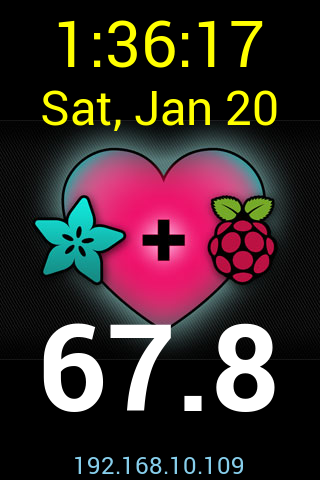

# office-pi-display

Script to display time and temperature on [Adafruit 3.5" Display](https://learn.adafruit.com/adafruit-pitft-3-dot-5-touch-screen-for-raspberry-pi) connected to a Raspberry Pi 3B and OneWire Temperature sensor in my office.

## Operation

The script reads the temperature from a OneWire sensor (via `owfs`), uses ImageMagick to place text (time, date, temperature, and ip address) over a background image, then uses `fbi` to show the image on the _framebuffer_ device.

Launch the script `show-temp` on startup or login of the default user. (to be written).

## Components

* [Adafruit 3.5" Display](https://learn.adafruit.com/adafruit-pitft-3-dot-5-touch-screen-for-raspberry-pi); 320x480 screen.
* OneWire Temperature Sensor
* OneWire Serial Bus Hub (via USB Serial)

## Configuration

* Follow Adafruit's [Easy Install](https://learn.adafruit.com/adafruit-pitft-3-dot-5-touch-screen-for-raspberry-pi/easy-install-2) for the display with 90-degree rotation.
* Configure Raspberry Pi with `raspi-config` **NOTE: Don't enable 1Wire**
* Install `owfs` and `imagemagick`
* Clone this repo and tweak any parameters needed in `show-temp`
* Run!

[background.jpg](http://adafruit-download.s3.amazonaws.com/adapiluv320x240.jpg) is copied and modifiled from [Adafruit PiTFT 3.5" Touch Screen for Raspberry Pi](https://learn.adafruit.com/adafruit-pitft-3-dot-5-touch-screen-for-raspberry-pi/displaying-images).
